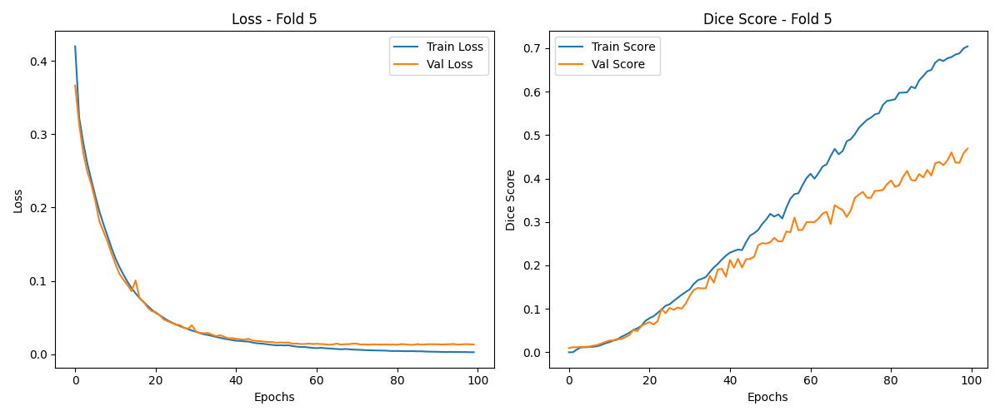

# Medical Image Segmentation on COVID CT Scans

This project will guide how to perform a basic image segmentation task via deep learning method. We deploy a deep learning framework to segment COVID-19 CT images. The name of the dataset is MosMedData, and the dataset is provided in this google drive https://drive.google.com/drive/folders/1vX40j_Y3A7zkyZJVG2PUaiRmW2f6THl9?usp=share_ link. There are totally 785 CT image slices as well as 785 corresponding segmentation annotations. This dataset does not provide officially data partitions for training and validation. To unify the code, I create a data partition for you to perform 5-folder cross validation. These are the following txt files after download the data: train new0.txt, train new1.txt, train new2.txt, train new3.txt, train new4.txt, valid new0.txt, valid new1.txt, valid new2.txt, valid new3.txt, valid new4.txt. Each file includes different names of image slices. For example, the train new0.txt includes the image samples of training dataset in the first folder cross-validation, while the valid new0.txt includes the image samples of validation dataset in this cross-validation.

### Guidelines

Download the dataset from [G-Drive](https://drive.google.com/drive/folders/1vX40j_Y3A7zkyZJVG2PUaiRmW2f6THl9) and place the folder `MosMedData` in the root directory. Then, run the following:
```bash
pip install -r requirements.txt
python main.py --train True
```
This will start the training.


```bash
python main.py --test True
```
This will start the evaluation and save the figures in results directory. We have provided our trained model for testing purpose. It's in `checkpoints/best_model.pth`

## Results


## Graph Plots



